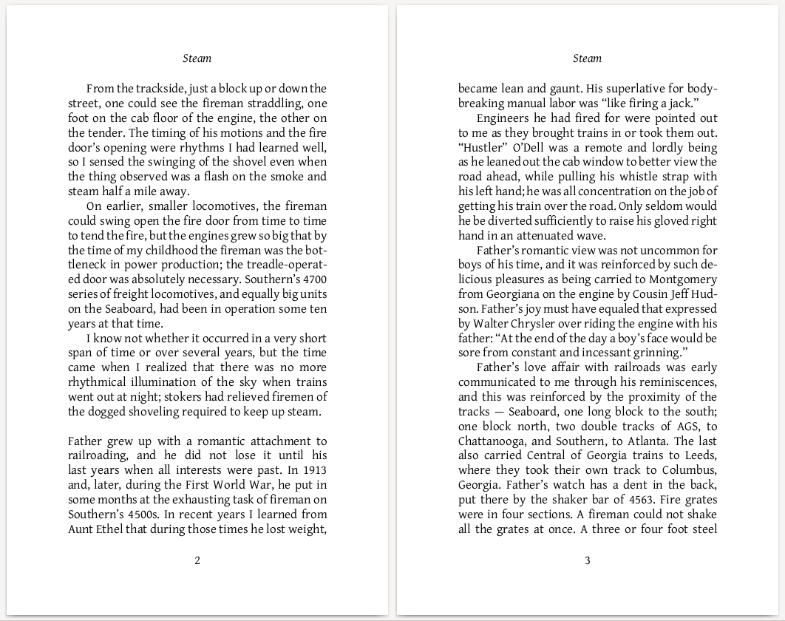

# A Python Typesetting package

(**Note:** I plan to add user documentation
to the library within the next couple of weeks;
simply “watch” this repository here on GitHub
if you want to follow along until it appears!)

This prototype library typesets paragraphs
using the same approach as TeX and LaTeX,
knows how to avoid widow and orphan lines
when splitting paragraphs across pages,
and produces PDF output:

Here is an example PDF that is typeset using the library:

[examples/steam/book.pdf](examples/steam/book.pdf)

The script that produced the above PDF
is here in the repository at `examples/steam/typeset.py`.

The vast difference this library’s approach and that of TeX or LaTeX
is that **this library leaves you entirely in control** —
paragraph justification and line breaking are a **subroutine**
that you call from normal Python code
that is otherwise free to draw on the page however it wishes!
You can draw titles, page numbers, and add media
using whatever underlying library calls you want,
and the `typesetting` library stays out of your way.
No longer will you be stuck
trying to center a title or draw
using abstruse configuration
piled atop underpowered boxes and glue primitives.

The process of designing this library
is described in the 2019 “Typesetting with Python” keynote talk
that I delivered at PyLondinium19:

https://www.youtube.com/watch?v=e7RVO0Sqr4s

I am happy that the talk (in the form of the above recording)
was also featured at the remote
[TUG2020 conference](https://tug.org/tug2020/program.html)
in July 2020,
which I celebrated by returning to the repository
and getting progress underway again!
